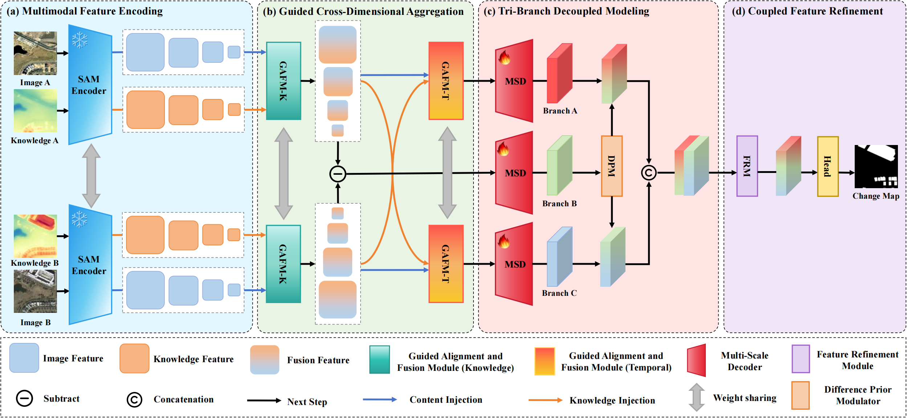

# KGDNet

**Knowledge-Guided Decoupled Modeling of Heterogeneous Change Mechanisms for Remote Sensing Change Detection**

KGDNet is a binary change-detection model for bi-temporal remote-sensing images. The current implementation uses RGB image pairs plus monocular depth maps as inputs, extracts frozen multi-scale FastSAM features, injects depth knowledge through guided attention, and decodes temporal and difference cues into a one-channel change logit map.



## Highlights

- Frozen FastSAM backbone for multi-scale feature extraction.
- RGB and depth streams for both time steps: `A`, `B`, `A_depth`, and `B_depth`.
- Guided Alignment Fusion Module (GAFM) for depth-guided feature fusion and temporal alignment.
- Three decoder branches for time-1, time-2, and absolute-difference features.
- Difference Probability Modulation (DPM) gate before the final refinement and prediction head.
- Training and evaluation scripts for LEVIR-CD-256, LEVIR-CD+-256, SYSU-CD, and WHU-CD.

## Repository Layout

```text
KGDNet/
+-- train.py                         # Training entry point
+-- pred_eval.py                     # Batch inference and metric evaluation
+-- environment.yml                  # Conda environment
+-- FastSAM-x.pt                     # FastSAM-x checkpoint used by default
+-- architecture.png                 # Network overview figure
+-- datasets/
|   +-- cd_dataset.py                # Unified RGB + depth dataset loader
+-- models/
|   +-- KGDNet_simple.py             # Main KGDNet implementation
|   +-- FastSAM/                     # Vendored FastSAM code
|   +-- Dav2/                        # Depth Anything V2 helper code
+-- utils/
|   +-- utils.py                     # Metrics, losses, seed helpers
|   +-- misc.py                      # Weight initialization and utility code
+-- results/                         # Prediction output root
```

## Environment

The provided environment targets Python 3.10 and CUDA 12.1.

```bash
conda env create -f environment.yml
conda activate KGDNet
```

Main packages include:

- `torch==2.1.0+cu121`
- `torchvision==0.16.0+cu121`
- `ultralytics==8.0.120`
- `scikit-image==0.25.2`
- `opencv-python-headless==4.9.0.80`
- `tensorboardX==2.6.5`

## Required Checkpoints

Download links:

- KGDNet weights: [Baidu Netdisk](https://pan.baidu.com/s/1NGjqbaE5EBaje7UWJ6LRvQ?pwd=7r1k), extraction code: `7r1k`
- FastSAM checkpoints: [FastSAM model checkpoints](https://github.com/CASIA-LMC-Lab/FastSAM#model-checkpoints)
- Depth Anything V2 checkpoints: [DepthAnything/Depth-Anything-V2](https://github.com/DepthAnything/Depth-Anything-V2)

The main model initializes FastSAM with:

```python
KGDNet(model_name='FastSAM-x.pt')
```

Place `FastSAM-x.pt` in the repository root, or change `model_name` in `models/KGDNet_simple.py`.

For depth generation, pass the Depth Anything V2 checkpoint path to `models/Dav2/pred_depth.py` with `--checkpoint`.

## Dataset Format

Each dataset root must contain `train` and `test` splits. The training script currently uses `train` for training and `test` for validation/testing.

```text
<DATASET_ROOT>/
+-- train/
|   +-- A/          # time-1 RGB images
|   +-- B/          # time-2 RGB images
|   +-- A_depth/    # time-1 depth maps
|   +-- B_depth/    # time-2 depth maps
|   +-- label/      # binary masks, usually 0/255 PNG
+-- test/
    +-- A/
    +-- B/
    +-- A_depth/
    +-- B_depth/
    +-- label/
```

Supported dataset names are defined in `datasets/cd_dataset.py`:

- `LEVIR-CD-256`
- `LEVIR-CD+-256`
- `SYSU-CD`
- `WHU-CD`

> **Datasets coming soon** — Datasets will be released soon.

Before training, edit `DATASET_CONFIGS` in `datasets/cd_dataset.py` so each `root` points to your local dataset path.

## Generate Depth Maps

If your dataset only contains RGB image pairs and labels, generate `A_depth` and `B_depth` once before training.

Install the extra Depth Anything V2 requirements:

```bash
pip install -r models/Dav2/requirements.txt
```

Run the script for every split and time step, passing the checkpoint path with `--checkpoint`:

```bash
cd models/Dav2

python pred_depth.py \
  --img-dir <DATASET_ROOT>/train/A \
  --outdir <DATASET_ROOT>/train/A_depth \
  --encoder vitl \
  --checkpoint <PATH_TO_DEPTH_ANYTHING_V2_CHECKPOINT>

python pred_depth.py \
  --img-dir <DATASET_ROOT>/train/B \
  --outdir <DATASET_ROOT>/train/B_depth \
  --encoder vitl \
  --checkpoint <PATH_TO_DEPTH_ANYTHING_V2_CHECKPOINT>
```

Repeat for `<DATASET_ROOT>/test/A` and `<DATASET_ROOT>/test/B`.

Use `--grayscale` if you want grayscale depth images. Without it, the script saves colorized `Spectral_r` depth maps. The dataset loader normalizes depth images by dividing by 255.

## Training

Example:

```bash
python train.py \
  --dataset-name LEVIR-CD-256 \
  --epochs 200 \
  --train-batch-size 32 \
  --val-batch-size 32 \
  --workers 8 \
  --lr 0.0001 \
  --crop-size 256 \
  --crop-nums 1 \
  --optimizer Adam \
  --gpus 0 \
  --test
```

Useful arguments:

| Argument | Default | Description |
| --- | --- | --- |
| `--dataset-name` | `LEVIR-CD-256` | Dataset key from `DATASET_CONFIGS` |
| `--epochs` | `100` | Number of training epochs |
| `--train-batch-size` | `16` | Training batch size |
| `--val-batch-size` | `16` | Validation batch size |
| `--workers` | `16` | DataLoader workers |
| `--lr` | `0.001` | Initial learning rate |
| `--crop-size` | `256` | Random crop size |
| `--crop-nums` | `1` | Number of random crops per source image |
| `--optimizer` | `Adam` | `Adam`, `AdamW`, or `SGD` |
| `--gpus` | `None` | Comma-separated CUDA device IDs |
| `--test` | off | Run final evaluation after training |

Training behavior:

- FastSAM is frozen inside `KGDNet.__init__`.
- Loss is `BCEWithLogitsLoss`.
- Scheduler is `CosineAnnealingLR`.
- The best checkpoint is selected by validation F1.
- Checkpoints are saved under `checkpoints/<dataset>/<YYYYMMDD>/`.
- TensorBoard logs are saved under `logs/<dataset>/`.
- Console output is copied to `train_<timestamp>.txt` in the checkpoint directory.

Note: `--freeze-sam` is currently parsed but not used because the backbone is already frozen by the model constructor.

## Inference and Evaluation

`pred_eval.py` performs batch prediction with optional test-time augmentation and writes binary prediction masks plus metrics.

Before running, check the constants near the top of `pred_eval.py`:

```python
DATA_NAME = 'WHU-CD'
DATA_ROOT = Data.get_root(DATA_NAME)
```

Also pass or update these paths:

- `--chkpt_path`: trained `.pth` checkpoint.
- `--test_dir`: test split directory containing `A`, `B`, `A_depth`, and `B_depth`.
- `--gt_dir`: ground-truth label directory.
- `--pred_dir`: output directory.

Example:

```bash
python pred_eval.py \
  --chkpt_path checkpoints/WHU-CD/20260601/WHU-CD_best_epoch0_OA0.9826_F10.8064_IoU0.6776.pth \
  --test_dir <DATASET_ROOT>/test \
  --gt_dir <DATASET_ROOT>/test/label \
  --batch-size 32 \
  --threshold 0.5
```

Outputs:

- Prediction masks: `<pred_dir>/*.png`
- Metric log: `<DATA_NAME>_KGDNet_metrics.log`
- Console summary with `OA`, `Precision`, `Recall`, `F1`, `IoU`, `mIoU`, and `mF1`

The evaluator can load plain state dictionaries and checkpoints wrapped as `{'model': state_dict}`. It also strips a leading `module.` prefix from DataParallel checkpoints.

## Model Inputs and Outputs

Forward signature:

```python
logits = model(imgA, imgB, depthA, depthB)
```

Expected tensor shapes:

```text
imgA, imgB, depthA, depthB: [B, 3, H, W]
logits:                    [B, 1, H, W]
```

Images and depth maps are normalized to `[0, 1]` by the dataset loader.

## Important Implementation Notes

- The dataset loader preloads all images into memory during dataset construction.
- `read_RSimages` only loads files ending with `.png`.
- Training validation currently uses `mode='test'`, not a separate `val` folder.
- `pred_eval.py` assumes all images in one evaluation batch have the same spatial size because it stacks tensors directly.
- `pred_eval.py` contains default absolute paths from the original machine. Override them with CLI arguments or edit the defaults before use.
- `models/Dav2/pred_depth.py` sets `CUDA_VISIBLE_DEVICES = '3'` inside the script. Remove or change that line if needed.

## Citation

If you use this code or KGDNet in your research, please cite:

```bibtex
@ARTICLE{11540179,
  author={Yang, Zongyu and Li, Haitao and Gu, Haiyan and Yang, Yi and Ding, Shaopeng and Kong, Haozhu},
  journal={IEEE Transactions on Geoscience and Remote Sensing},
  title={KGDNet: Knowledge-Guided Decoupled Modeling of Heterogeneous Change Mechanisms for Remote Sensing Change Detection},
  year={2026},
  volume={},
  number={},
  pages={1-22},
  keywords={Remote sensing, change detection, knowledge-guided learning, multimodal data alignment, decoupled change modeling},
  doi={10.1109/TGRS.2026.3698111}
}
```

## Acknowledgements

This repository includes or builds on:

- [FastSAM](https://github.com/CASIA-IVA-Lab/FastSAM)
- [Depth Anything V2](https://github.com/DepthAnything/Depth-Anything-V2)
- Public remote-sensing change-detection datasets such as LEVIR-CD, LEVIR-CD+, SYSU-CD, and WHU-CD
